# AI-Agents

### Una misión. Tres formas de pensar.

**Un laboratorio interactivo para explorar cómo agentes especializados analizan problemas, comparten información y toman decisiones en equipo.**

Proyecto personal de [JorgeCobos03](https://github.com/JorgeCobos03), desarrollado con **Python, C++20 y WebAssembly**.

**[Abrir la demo →](https://ai-agents-topaz-three.vercel.app/)**

## ¿Qué es?

AI-Agents es una demostración visual de un sistema multiagente aplicado a la atención de incidentes tecnológicos. Ante una lista de problemas y recursos limitados, el sistema clasifica los incidentes, propone cuáles atender y revisa las decisiones.

La web permite observar a los agentes **trabajando juntos o por separado**, seguir sus mensajes y comparar los resultados. Nubes de partículas en Canvas representan a cada especialista: se mueven, intercambian señales y cambian de actividad durante la misión. Cada ejecución ocurre en el navegador del visitante, sin registro ni claves de acceso.

## ¿Para qué es?

El proyecto hace visible algo que suele quedar oculto en los sistemas de IA: **cómo una decisión pasa de un componente a otro y qué aporta cada uno**.

Su propósito es mostrar la combinación de aprendizaje automático en Python, optimización en C++ y una experiencia web donde se pueden explorar los resultados. El escenario de incidentes permite entender cómo priorizar cuando no es posible atender todo al mismo tiempo.

## ¿Cómo funciona?

El usuario elige un escenario y establece un presupuesto de esfuerzo. A partir de esa entrada, tres agentes asumen responsabilidades diferentes:

| Agente | Qué hace | Qué aporta |
|---|---|---|
| **Analista** | Clasifica el texto como seguridad, disponibilidad o rendimiento con un modelo entrenado en Python. | Una categoría y una puntuación del modelo para cada incidente. |
| **Planificador** | Ejecuta un optimizador C++ dentro del navegador mediante WebAssembly. | La combinación de incidentes con mayor prioridad total que cabe en el presupuesto. |
| **Revisor** | Comprueba el esfuerzo del plan y señala clasificaciones con evidencia insuficiente. | Una revisión del presupuesto y avisos de incertidumbre. |

Un coordinador organiza los pasos y registra los intercambios. En modo colaborativo, cada agente utiliza el resultado del anterior.

### Trabajar juntos o por separado

**En equipo**, el analista comparte su clasificación con el planificador. Una política explícita añade 15 puntos de prioridad a los incidentes de seguridad con puntuación del modelo igual o superior al 55%, hasta un máximo de 100. El planificador selecciona el conjunto óptimo y el revisor comprueba el resultado.

**En modo individual**, se ejecuta únicamente el agente elegido:

- El **analista** clasifica los incidentes sin elaborar un plan.
- El **planificador** utiliza los impactos originales, sin ajustes derivados de la clasificación.
- El **revisor** audita una propuesta formada por los tres primeros incidentes y permite detectar si excede el presupuesto.

Así se puede observar qué cambia al compartir información y qué resultados quedan incompletos cuando solo participa un agente.

### Python, C++ y la experiencia web

Python entrena un modelo estadístico **Naive Bayes** con ejemplos sintéticos en español e inglés. La web utiliza sus parámetros para clasificar texto. C++ resuelve la selección de incidentes mediante programación dinámica y se ejecuta como WebAssembly.

Vercel aloja los archivos de la aplicación. El trabajo de los agentes ocurre en un proceso separado del navegador para mantener la interfaz fluida. Cada visitante tiene una sesión independiente; los textos introducidos no se envían a una API de IA. La escena utiliza Canvas 2D con perspectiva para dar volumen a las partículas, sin descargar modelos ni texturas.

## Utilidad

- **Entender la colaboración multiagente:** ver qué recibe, produce y comunica cada agente.
- **Explorar decisiones con recursos limitados:** cambiar el presupuesto y observar qué incidentes entran en el plan.
- **Comparar estrategias:** contrastar una planificación independiente con otra que incorpora la clasificación del analista.
- **Identificar incertidumbre:** reconocer cuándo el modelo dispone de poca evidencia y hace falta revisión humana.
- **Examinar resultados:** consultar las trazas y descargar una ejecución con sus entradas y decisiones.

## Aplicaciones

El laboratorio ilustra patrones que pueden adaptarse a problemas como:

| Contexto | Aplicación del patrón |
|---|---|
| **Operaciones de software** | Clasificar incidencias y priorizar su atención según impacto y capacidad. |
| **Soporte técnico** | Organizar solicitudes por tipo y preparar una propuesta de atención. |
| **Planificación de tareas** | Elegir un conjunto de actividades cuando el esfuerzo disponible es limitado. |
| **Educación y experimentación** | Explicar agentes especializados, clasificación de texto, optimización y decisiones auditables. |

Son aplicaciones posibles de la arquitectura. La demo trabaja con incidentes sintéticos y no está conectada a sistemas reales de soporte, seguridad o producción.

## ¿Cómo se usa?

1. Abre **[AI-Agents en la web](https://ai-agents-topaz-three.vercel.app/)**.
2. Selecciona una situación: **Lanzar una plataforma**, **Mantener una tienda online** o **Investigar algo inesperado**.
3. Elige **En equipo** o toca uno de los tres agentes para verlo trabajar en modo **Individual**. También puedes elegirlo desde el selector.
4. Ajusta los **recursos disponibles**. Cambiar la situación, los recursos o el agente inicia una nueva misión; **Ejecutar misión** permite repetirla manualmente.
5. Sigue las actividades de **Entender**, **Decidir** y **Comprobar**. Debajo encontrarás los resultados y el registro de decisiones.
6. Añade un problema propio desde **¿Y si el problema fuera otro?** o descarga una ejecución con **Exportar**.

La **demo automática** comienza al entrar y repite la misión periódicamente. Puedes desactivarla para explorar un resultado con calma. **Pausar movimiento** detiene la animación visual; los controles siguen funcionando. Si tu dispositivo tiene activada la preferencia de movimiento reducido, la página comienza sin animaciones ni ejecución automática. El botón **¿Es tu primera vez?** explica los tres pasos básicos.

### Tres pruebas para explorar

- **Colaboración:** ejecuta el mismo escenario y presupuesto en equipo y después con el planificador individual. Observa si la prioridad de seguridad cambia el plan.
- **Recursos insuficientes:** selecciona el revisor individual y reduce el presupuesto. El sistema señalará si la propuesta de los tres primeros incidentes lo excede.
- **Incertidumbre:** ejecuta **Investigar algo inesperado** en equipo. Algunos textos no contienen vocabulario conocido y se señalan para revisión humana.

### Cómo interpretar lo que ves

El **esfuerzo** representa unidades de trabajo de demostración; el **impacto**, una valoración proporcionada en el escenario. La selección maximiza la suma de prioridades dentro del presupuesto, no el número de incidentes atendidos. **En espera** significa que el incidente quedó fuera del plan, no que carezca de importancia.

La puntuación de clasificación es una probabilidad estadística **no calibrada**: un valor alto no garantiza que la categoría sea correcta. El indicador de cómputo muestra el tiempo real de procesamiento, sin contar la animación del registro. El movimiento de partículas es una representación visual; cada misión sí ejecuta clasificación y planificación reales. La animación se limita a 30 fotogramas por segundo y se pausa cuando la escena sale de pantalla o la pestaña queda oculta.

Este proyecto utiliza IA estadística y reglas explícitas, con un conjunto pequeño de datos sintéticos. Su finalidad es educativa y demostrativa; no genera respuestas como un LLM ni ejecuta acciones sobre infraestructura real. La demo no requiere servicios de inferencia de pago; su disponibilidad depende de las cuotas del alojamiento gratuito de Vercel.
