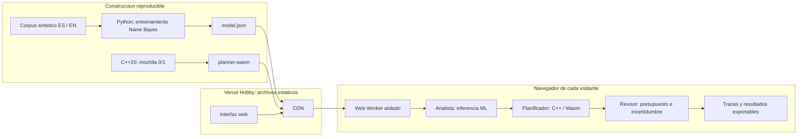
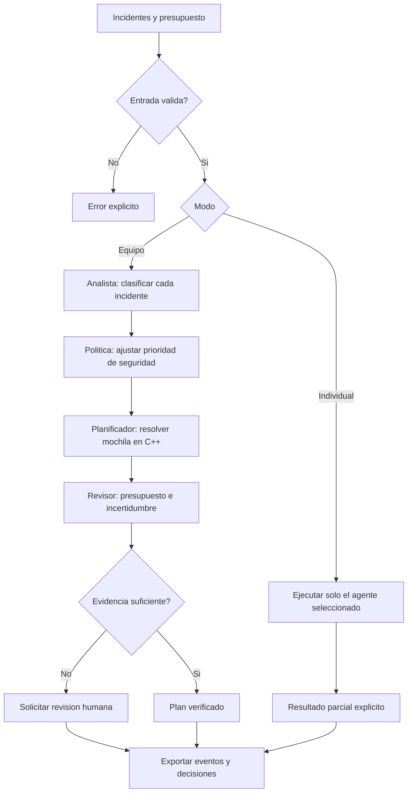

# AI-Agents

### Independent minds. Shared context.

A transparent multi-agent incident-response laboratory built with **Python, C++20 and WebAssembly**. Train a small bilingual ML model, optimize a constrained response plan, and inspect every handoff in a browser. No API keys, paid inference, backend functions, or account required for visitors.

[](https://github.com/JorgeCobos03/AI-Agents/actions/workflows/ci.yml)


**[Español ↓](#qué-demuestra)** · [Architecture](#arquitectura) · [Reproduce](#ejecución-local) · [Model card](docs/MODEL_CARD.md) · [Evaluation](docs/evaluation.json)

## Qué demuestra

AI-Agents convierte la coordinación multiagente en algo observable. Cada agente tiene una responsabilidad, entradas, salidas y un registro de decisiones. La demo compara cómo cambia el resultado cuando se comparte contexto y cuando un agente trabaja solo.

| Agente | Implementación | Responsabilidad |
|---|---|---|
| Analista | Naive Bayes entrenado en Python; inferencia equivalente en JavaScript | Clasificar seguridad, disponibilidad o rendimiento; detectar vocabulario desconocido |
| Planificador | C++20 real compilado a WebAssembly | Maximizar prioridad con un presupuesto mediante mochila 0/1 exacta |
| Revisor | Reglas explícitas de verificación | Comprobar presupuesto y señalar falta de evidencia |
| Coordinador | Web Worker en la demo; `asyncio` en Python | Orquestar el flujo, mantener contexto y emitir eventos |

**Esto es IA estadística y agentes especializados de alcance limitado, no un LLM ni una plataforma de agentes autónomos generales.** El revisor es determinista. Los incidentes son sintéticos y ninguna acción afecta infraestructura real. La animación reproduce eventos calculados; el indicador de cómputo mide la ejecución real sin el tiempo de animación.

### Experimentos

1. Ejecuta **En equipo**: el analista comparte clasificaciones, el planificador consume esa evidencia y el revisor audita el resultado.
2. Cambia a **Individual → Planificador**: optimiza los impactos originales, sin la clasificación. Compara el conjunto seleccionado.
3. Ejecuta **Individual → Revisor** con presupuesto bajo: revisa una propuesta FIFO de los tres primeros incidentes y detecta el exceso de presupuesto.
4. Prueba **Evidencia incompleta**: los textos sin vocabulario conocido se marcan para revisión humana.
5. Añade un incidente propio o exporta el resultado JSON, incluyendo entradas, prioridades, decisiones y eventos.

La política del equipo añade **15 puntos** a incidentes clasificados como seguridad con posterior ≥0.55, hasta un máximo de 100. Esta política es explícita y configurable en el código; no es una capacidad aprendida. El presupuesto y los impactos son unidades de demostración, no dinero ni tiempos estimados.

## Arquitectura

Diagrama preparado con Mermaid Chart y almacenado como Mermaid nativo para que GitHub lo renderice sin dependencias externas.





Los agentes del navegador ejecutan un DAG secuencial porque cada fase consume la anterior. Python clasifica incidentes mediante tareas `asyncio` cooperativas; no se afirma paralelismo de CPU. Cada visitante tiene un Worker independiente: no hay memoria compartida entre usuarios ni procesos residentes en la nube.

## Ejecución local

Requisitos: **Python 3.11+** y **Node.js 20+**. La demo no requiere instalar paquetes npm y el Wasm compilado viene incluido.

```bash
git clone https://github.com/JorgeCobos03/AI-Agents.git
cd AI-Agents
python scripts/train.py
npm test
python -m unittest discover -s tests -p "test_*.py" -v
npm run build
npm run dev
```

Abre **http://localhost:5173**. Se necesita HTTP; abrir `index.html` con `file://` no permite cargar el Worker.

### Reconstruir C++ → WebAssembly

```bash
python -m pip install ziglang==0.13.0
python scripts/build_wasm.py
npm test
```

`planner.wasm` contiene el código de `cpp/planner.cpp`, sin bibliotecas C++ externas ni llamadas de red. El compilador es dependencia de desarrollo, no de la web. El optimizador usa memoria fija y complejidad **O(n × presupuesto)**, con límites de 20 incidentes y 100 unidades. Su API C expone `set_task` y `solve`; el resultado es una máscara de bits. Los empates conservan la solución anterior, de forma determinista.

### Python + C++ nativo

```bash
cmake -S cpp -B build
cmake --build build
PYTHONPATH=python python -m agents --native ./build/libplanner.so
```

En PowerShell:

```powershell
$env:PYTHONPATH="python"
python -m agents                          # Referencia Python
python -m agents --native ./build/Debug/planner.dll  # CMake / Visual Studio
```

La ruta de la biblioteca depende del generador y sistema operativo. `ctypes` configura explícitamente los tipos de la ABI. La biblioteca nativa mantiene buffers internos y debe serializarse si se comparte entre hilos; cada Worker de la demo tiene su propia instancia Wasm.

## Calidad y evaluación

- Clasificador reproducible: 48 ejemplos de entrenamiento, 18 ejemplos reservados, tres clases y dos idiomas. Resultados y advertencias en [evaluation.json](docs/evaluation.json).
- Pruebas del optimizador Wasm frente a búsqueda exhaustiva en 120 problemas generados con semilla fija.
- Referencia Python frente a búsqueda exhaustiva en 50 problemas adicionales.
- Pruebas de límites, presupuesto cero, 20 incidentes, colaboración efectiva, abstención y revisión de propuestas inválidas.
- CI recompila C++, prueba la integración Python nativa y ejecuta el mismo Wasm que consume la web.
- El build verifica los artefactos y exige menos de 250 KB para los siete archivos principales, sin compresión.

Un 100% en este diminuto conjunto sintético **no demuestra precisión en producción**. Consulta la [model card](docs/MODEL_CARD.md). El proyecto prioriza trazabilidad y reproducibilidad sobre afirmaciones de rendimiento sin evidencia.

## Despliegue gratuito y límites

Importa este repositorio en un equipo **Vercel Hobby**, framework **Other**, comando `npm run build`, directorio de salida **web**. `vercel.json` contiene la configuración. No añadas variables de entorno ni servicios de pago.

La web se aloja en la nube; la inferencia y optimización se ejecutan en el dispositivo del visitante. No hay funciones serverless, cron, base de datos, keep-alive, API de IA ni servidor que mantener despierto. Las sesiones se eliminan al cerrar o recargar la página; la exportación es local.

**Gratis no significa ilimitado ni disponibilidad garantizada.** Los archivos consumen solicitudes CDN y transferencia. Las cuotas son compartidas con otros proyectos del equipo y pueden cambiar; superar límites de Hobby puede interrumpir el servicio. No es posible prometer "siempre activo para cualquier tráfico" en un plan gratuito. Revisa Usage antes de compartir la demo ampliamente. No se habilitan mejoras de pago automáticas desde este proyecto.

Fuentes oficiales: [Hobby](https://vercel.com/docs/plans/hobby), [límites](https://vercel.com/docs/limits), [uso aceptable](https://vercel.com/docs/limits/fair-use-guidelines). Hobby es para proyectos personales no comerciales. Verificado el 8 de octubre de 2026; consulta las páginas y el panel para las cuotas vigentes.

## Estructura

```text
cpp/                   Motor C++20 y CMake
python/agents/         Entrenamiento, inferencia, asyncio y puente ctypes
data/corpus.json       Datos sintéticos versionados con split explícito
scripts/               Entrenamiento, compilación y verificación de build
web/                   UI, Worker, inferencia, modelo y Wasm
tests/                 Pruebas Python y Node/Wasm
docs/                  Model card y evaluación reproducible
.github/workflows/     CI con Python, C++ y Wasm
```

## Privacidad y seguridad

Las entradas se procesan localmente y se insertan como texto, nunca como HTML. Hay validación de rangos, límite de texto y un tiempo máximo de ejecución. La CSP restringe recursos al mismo origen y permite WebAssembly. No hay analítica ni envío de texto a terceros. Vercel procesa las solicitudes normales de alojamiento conforme a sus políticas. No introduzcas información confidencial en demos públicas.

## Contribuir

Consulta [CONTRIBUTING.md](CONTRIBUTING.md), [SECURITY.md](SECURITY.md) y la [licencia MIT](LICENSE). Las mejoras útiles incluyen corpus externos con licencia, evaluación de calibración, políticas configurables y nuevos optimizadores con pruebas de equivalencia.

Built by [JorgeCobos03](https://github.com/JorgeCobos03).
